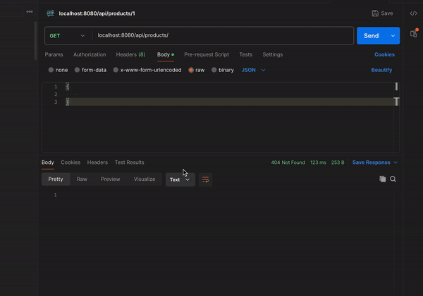
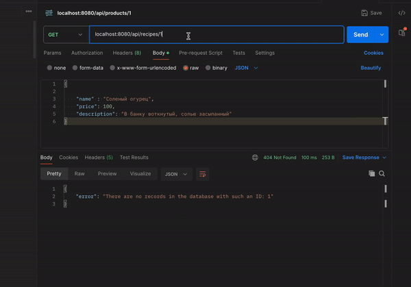
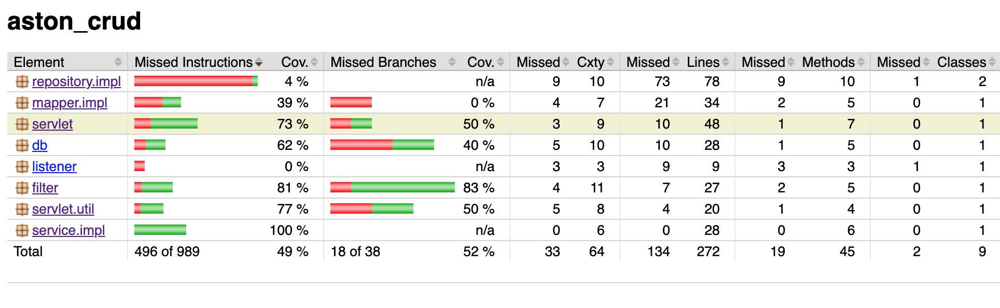

# CRUD Application или средневеко́вье программиста


CRUD Application — это REST сервис для выполнения операций CRUD (Create, Read, Update, Delete), созданный с использованием сервлетов и JDBC, без использования Spring и Hibernate.


## Описание проекта

Этот проект представляет собой пример реализации базовых операций CRUD с использованием Java сервлетов и JDBC. Он демонстрирует простую архитектуру RESTful API для управления сущностями в базе данных, придерживаясь принципов ООП и SOLID.

## Функциональность

- **Create**: Добавление новых сущностей в базу данных.
- **Read**: Получение информации о сущностях из базы данных.
- **Update**: Изменение существующих сущностей в базе данных.
- **Delete**: Удаление сущностей из базы данных.

## Технологии

- Java
- JDBC
- PostgreSQL или MySQL
- Maven
- Lombok

## Архитектура проекта

- **Servlet**: Обработка HTTP запросов и возврат DTO.
- **Service**: Логика приложения, покрытая юнит тестами.
- **Repository**: Работа с базой данных через JDBC.
- **Mapper**: Преобразование между Entity и DTO.
- **DTO**: Data Transfer Objects, используемые для передачи данных.
- **Entity**: Сущности базы данных.

### Примеры работы методов для сущностей

```Product /api/products/```


```http
GET /api/products/{id}

POST /api/products/
{name : Молоко, price: 35, 
description: Молочный продукт из под коровы}

PUT /api/products/
{id: 1, name : Квас, price: 100, 
description: Молочный продукт из под коровы}

DELETE /api/products/{id}
```




### 
```Recipe /api/recipes/```
```http
// предварительно создадим продукты для рецепта
POST /api/products/
{name : Молоко, price: 35, 
description: Молочный продукт из под коровы}
{name : Соленый огурец, price: 100, 
description: В банку воткнутый, солью засупанный}


POST /api/recipes/
{name : Молоко с соленым огурцом, 
description: Пробуждающий напиток, пить вечером на тощак,
productId: [2,3]}

PUT /api/recipes
{id: 1,
name : Молоко с огурцом, 
description: Пробуждающий напиток}

DELETE /api/products/{id}
```



## Структура БД
```sql
-- Таблица продуктов
CREATE TABLE product (
    id SERIAL PRIMARY KEY,
    name VARCHAR(100) NOT NULL unique ,
    description VARCHAR(255),
    price INTEGER
);

-- Таблица рецептов
CREATE TABLE recipe (
    id SERIAL PRIMARY KEY,
    name VARCHAR(100) NOT NULL unique ,
    description VARCHAR(255)
);

-- Таблица, связывающая рецепты с продуктами (многие ко многим)
CREATE TABLE recipe_product (
    recipe_id INTEGER REFERENCES recipe(id) ON DELETE CASCADE,
    product_id INTEGER REFERENCES product(id)  ON DELETE CASCADE,,
    PRIMARY KEY (recipe_id, product_id)
);
```

## Тестирование

- Покрытие слоя сервиса юнит тестами на 80% с использованием JUnit, Mockito и Parameterized Tests.

